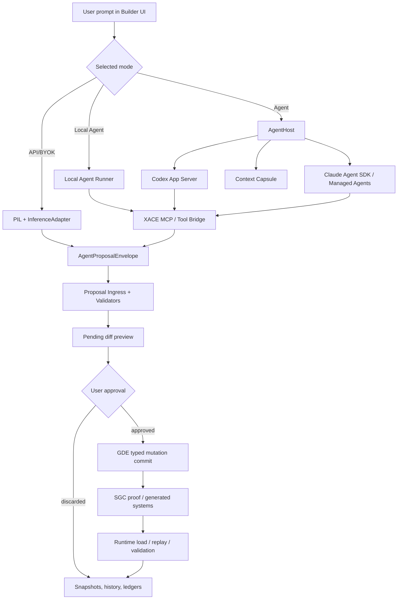

# XACE Agent-Native Architecture Plan

Status: pre-implementation architecture report
Research snapshot: 2026-08-31
Directive honored: do not implement the feature yet; audit, verify, design, and produce the roadmap first.
Amendments incorporated: 2026-08-31 approval refinements.
Repository-evidence objections to amendments: none.

## 1. Executive Decision

XACE should add agent-native support as a side-by-side orchestration layer, not as a replacement for the existing Prompt Intelligence Loop (PIL), inference adapter, Graph Domain Engine (GDE), Semantic Generation Compiler (SGC), or runtime validation stack.

The governing rule remains:

> AI proposes. XACE authorizes.

In practice, that means external agents such as Codex, future Anthropic agent surfaces, or a local agent runner may inspect a constrained XACE context and call XACE-owned tools, but they must not directly mutate the project, CGS, engine adapter files, generated systems, runtime state, or shell environment. Every change still enters XACE as a typed proposal, is validated, is previewed to the user, and is committed only through the existing GDE/SGC/runtime authority chain.

Recommended mode split:

- Agent Mode: provider-native agents connected through an `AgentHost` abstraction. First and primary production target is Codex App Server over stable stdio JSONL, with XACE using provider-native App Server capabilities for auth, model discovery, account/rate-limit state, threads, resume/fork, compaction, streamed events, and cancellation wherever sensible.
- API / BYOK Mode: keep the current provider API path through `InferenceAdapter`; improve capability discovery and billing clarity, but do not force an agent runtime.
- Local Agent Mode: architecturally reserved as a later local XACE agent loop over local models, using the same tool and proposal contracts as provider agents. It is not required for Codex Agent Mode completion.

Do not build the first iteration around a plain CLI command wrapper. Codex App Server is the better first-class integration point because it exposes product-grade surfaces for auth, model discovery, threads, resume/fork, streamed events, and approvals. XACE should also investigate a XACE-managed, pinned Codex runtime as the preferred eventual public-product distribution model, while keeping externally installed Codex detection useful for development and fallback. Bundling must not be implemented until redistribution, packaging, auth-storage, update, and compatibility implications are verified.

The current implementation window is production-grade Codex Agent Mode. Claude adapter interfaces should remain reserved, but Claude execution is deferred; the goal is to remove API-first dependence for users through the cleanest currently supported subscription-backed product integration path, which is Codex App Server.

## 2. Current-State Audit

### 2.1 What XACE Already Has

The existing prompt-to-mutation pipeline is already unusually strong for a game-builder architecture:

1. Browser sends `pil_process` over the builder WebSocket.
2. `ws_message_router.py` classifies the prompt and blocks or clarifies unsupported intent before expensive inference.
3. `session_manager.py` checks provider readiness and launches `PILPipeline`.
4. `PILPipeline` assembles diagnostics, project context, memory, and a structured multi-pass LLM plan.
5. `InferenceAdapter` dispatches to the selected provider, normalizes the response, estimates usage, records telemetry, and caches eligible responses.
6. The builder creates a pending transaction and preview diff.
7. The user explicitly approves through `pil_apply`.
8. `GDEOrchestrator` applies typed operations against an isolated copy and validates the full CGS before commit.
9. Structural changes trigger SGC planning/proof generation.
10. Runtime validation, replay validation, adapter validation, snapshots, proof bundles, and prompt mutation history are persisted.
11. Downstream failure rolls back the pending apply path.

This is already the right center of gravity. Agent-native support should plug into this pipeline as a better planner/tool user, not bypass it.

### 2.2 Current Provider Model

Primary modules:

- `packages/inference/src/provider_registry.py`
- `packages/inference/src/inference_adapter.py`
- `packages/inference/src/model_descriptor.py`
- `packages/inference/src/model_router.py`
- `packages/inference/src/provider_model_discovery.py`
- `packages/inference/providers/openai_provider.py`
- `packages/inference/providers/anthropic_provider.py`
- `packages/inference/providers/google_provider.py`
- `packages/inference/providers/local_provider.py`
- `packages/builder-workspace/server/provider_settings.py`
- `packages/builder-workspace/server/credential_store.py`

Current behavior:

- Providers are API clients, not agent runtimes.
- OpenAI uses a Chat Completions-compatible path with bearer API key support, JSON-schema structured output support, model health through `/models`, and token normalization.
- Anthropic uses Messages API, tool-choice structured output, cache-control blocks, and token accounting.
- Google uses Gemini API with response schema support and implicit cache accounting.
- Local uses an OpenAI-compatible endpoint such as Ollama/vLLM, with zero-price descriptors.
- Provider selection in the builder resolves one selected provider/model and maps all logical tiers onto that model.
- The builder's BYOK descriptor currently sets generic context/capability values and `0.0` pricing, so provider billing boundaries and cost estimates are not authoritative.

What is absent:

- No Codex App Server adapter.
- No Codex SDK adapter.
- No Claude Code or Claude Agent SDK adapter.
- No MCP server exposing XACE-native tools to agents.
- No persistent provider-agent session registry.
- No agent event stream in the UI.
- No capability model for native agent tools, provider auth state, installation state, agent version, or approval semantics.

### 2.3 Current Session, History, and Memory

Primary modules:

- `packages/builder-workspace/server/session_manager.py`
- `packages/builder-workspace/server/ws_message_router.py`
- `packages/prompt-intelligence/src/history_manager/session_store.py`
- `packages/prompt-intelligence/src/history_manager/prompt_history.py`
- `packages/core/src/persistence/cgs_persistence.py`

Current behavior:

- Builder sessions are in-memory and keyed by WebSocket `session_id`.
- A disconnected session can resume only while the process keeps it in memory.
- Durable project state exists through `.xace` snapshots, execution plans, proof bundles, mutation ledgers, and prompt history events.
- Prompt history supports undo/redo of prompt-applied mutations.
- The prompt-intelligence session store is a ring buffer, not a durable chat/event transcript.
- `PILPipeline` builds a memory assembly, but that memory is not currently a first-class provider-agent thread or full conversation model.

Agent-native gap:

Agents need durable thread/session metadata, resumable provider thread IDs, event logs, approval records, tool-call records, mutation lineage, and compact summaries tied to exact CGS hashes. The existing in-memory builder session cannot be the only source of truth.

### 2.4 Current Trust and Mutation Safety

XACE already has the pieces needed to keep agents from becoming the authority:

- Typed operations are applied by GDE, not by provider code.
- GDE validates on an isolated CGS copy before committing.
- SGC compiles and signs trusted generated systems locally.
- Runtime adapters apply deltas through protocol surfaces rather than arbitrary code edits.
- MutationGate in runtime-core queues world mutations and applies them deterministically at phase boundaries.
- `pil_apply` performs stale-CGS checks, conflict checks, persistence, runtime validation, and rollback.
- The terminal WebSocket is explicitly separate from the main builder channel.

Agent-native risk:

Codex, Claude Code, and similar tools are built to read files, edit files, and run commands in normal coding workflows. XACE must not grant them that raw authority over the real project root. The agent should receive a constrained context capsule and an XACE tool surface instead.

## 3. Official Provider Integration Findings

Sources checked on 2026-08-31:

- OpenAI Codex App Server docs: https://developers.openai.com/codex/app-server
- OpenAI Codex SDK docs: https://developers.openai.com/codex/codex-sdk
- OpenAI Codex CLI docs: https://developers.openai.com/codex/cli
- OpenAI Codex MCP server docs: https://learn.chatgpt.com/docs/mcp-server
- OpenAI Codex non-interactive mode docs: https://developers.openai.com/codex/non-interactive-mode
- OpenAI Codex harness announcement: https://openai.com/index/unlocking-the-codex-harness/
- Anthropic Claude Code getting started: https://docs.anthropic.com/en/docs/claude-code/getting-started
- Anthropic Claude Code CLI usage: https://docs.anthropic.com/en/docs/claude-code/cli-usage
- Anthropic Claude Agent SDK overview: https://code.claude.com/docs/en/agent-sdk/overview
- Anthropic Claude account-login guidance for third-party tools: https://support.claude.com/en/articles/13189465-log-in-to-your-claude-account
- Anthropic Claude Code usage and limits: https://support.claude.com/en/articles/14552983-models-usage-and-limits-in-claude-code
- Anthropic API authentication: https://platform.claude.com/docs/en/manage-claude/authentication
- Anthropic Managed Agents quickstart: https://platform.claude.com/docs/en/managed-agents/quickstart
- Anthropic Managed Agents sessions/events/tools/permissions docs:
  - https://platform.claude.com/docs/en/managed-agents/sessions
  - https://platform.claude.com/docs/en/managed-agents/events-and-streaming
  - https://platform.claude.com/docs/en/managed-agents/tools
  - https://platform.claude.com/docs/en/managed-agents/permission-policies
  - https://platform.claude.com/docs/en/managed-agents/mcp-connector

### 3.1 OpenAI Codex

OpenAI's current Codex surface is not just a terminal program. The App Server protocol is the first and primary production integration target for the VS Code-like XACE experience because it provides:

- JSON-RPC over stdio JSONL as the stable transport.
- Authentication flows for API-key and ChatGPT-backed sign-in.
- Account and rate-limit status surfaces.
- Model discovery with available models, reasoning effort levels, modalities, defaults, upgrade status, and hidden flags.
- Thread start/resume/fork/read/list/name/archive/compact APIs.
- Streamed agent events suitable for rich client UI.
- Approval requests for commands, file changes, MCP actions, and dynamic tools.

Codex SDK is useful if XACE wants a Python or TypeScript control layer over local Codex/app-server behavior. It is narrower than App Server for rich product embedding. codex exec is appropriate for CI, smoke tests, or one-shot automation, not the primary interactive builder integration. codex mcp-server should not be used as the core integration path because OpenAI's current docs mark it deprecated in favor of App Server.

Preferred tool model: XACE should expose its own MCP/tool bridge to Codex through App Server-supported MCP configuration where supported. AgentAdapter owns provider lifecycle, auth, session, event, cancellation, and capability mapping. XACE's tool contract owns project context retrieval, validation, proposal submission, and permission policy. Direct provider-specific tool wiring remains a fallback only when MCP is not supported or not sufficient.

Distribution model: XACE should investigate shipping a XACE-managed, pinned Codex runtime for public builds so users do not permanently need to install/update a global CLI separately. This remains a research and packaging task until legal redistribution, binary provenance, auth storage, update cadence, compatibility checks, and rollback behavior are verified.

Important security note: Codex App Server includes a shell-command method that can run outside the sandbox with full access. XACE must not expose this to game-building agents. If command execution is ever needed, route it through XACE-owned, allowlisted runtime and validation tools.

### 3.2 Anthropic Claude

Claude Code is a local coding agent with CLI sessions, resume/continue commands, MCP support, and subscription or API-key authentication options. Claude Agent SDK provides Python and TypeScript libraries that embed Claude Code-like agent behavior, including file/search/edit/command tools, sessions/resume, MCP, and permissions.

The policy-sensitive finding is that Anthropic's official Agent SDK guidance tells third-party product developers not to offer claude.ai login or subscription limits unless previously approved, and to use API-key authentication methods for products built for others. Anthropic support guidance also says developers building tools for others should use Console API keys or supported cloud providers.

Therefore:

- XACE should not present "Claude subscription login" as a default third-party Agent Mode unless Anthropic explicitly approves that usage.
- XACE may keep Claude API/BYOK through the current Anthropic Messages provider.
- XACE may later add an API-backed Claude Agent SDK or Anthropic Managed Agents adapter if the user supplies Anthropic API credentials and accepts provider billing.
- XACE should clearly display whether usage is subscription-backed, API-key-backed, or cloud-provider-backed, because billing and rate limits differ.

### 3.3 Provider Matrix

| Provider surface | Best XACE mode | Auth/account stance | Billing boundary | Session support | Tool/approval support | Recommendation |
| --- | --- | --- | --- | --- | --- | --- |
| OpenAI Codex App Server | Agent Mode | Provider-owned auth through App Server; API key or ChatGPT sign-in where supported | Provider account/plan/API usage, surfaced as provider-managed | Strong thread start/resume/fork/list/compact | Strong event stream, cancellation, MCP, and approval primitives | First and primary production native agent adapter |
| OpenAI Codex SDK | Agent Mode implementation helper | Uses local Codex/app-server auth | Same as Codex/App Server | Good, especially for programmatic control | Useful for automation | Use behind adapter if it simplifies Python integration |
| OpenAI `codex exec` | CI/smoke helper | CLI auth/config | Provider-managed | Limited one-shot/resume via CLI patterns | JSONL events possible | Do not use as primary UI agent |
| Claude Code CLI | Possible local developer integration | Direct user CLI auth; third-party product login is policy-sensitive | Subscription or API, depending config | Continue/resume CLI sessions | MCP and permission concepts | Do not default until policy/product stance is resolved |
| Claude Agent SDK | Reserved future Agent Mode, likely API-backed | Official guidance favors API key/cloud provider for third-party products | API/cloud-provider billing | Sessions/resume | Built-in tools, MCP, permissions | Reserve interface; do not build for provider-count parity |
| Anthropic Managed Agents | Reserved future Agent Mode, cloud/API-backed | Anthropic API auth | Anthropic API billing | Cloud sessions with event stream/checkpointing | Built-in/custom/MCP tools and permission policies | Future option, not needed for Codex Agent Mode launch |
| OpenAI/Anthropic/Google/Moonshot API clients | API / BYOK Mode | User API key in OS vault | User API account; XACE estimates only when pricing is current | Current in-process session only | Structured-output calls, no native agent loop | Keep and harden |
| Ollama/vLLM/local OpenAI-compatible endpoints | Local Agent Mode or API-like local mode | Local endpoint | User hardware/local runtime | XACE-defined only | XACE-defined tool runner needed | Build local agent loop over same contracts |
| Future agent providers | Agent Mode | Provider-specific | Provider-specific | Capability-discovered | Capability-discovered | Fit through `AgentAdapter` contract |

## 4. Target Architecture

### 4.1 Modes

XACE should expose three explicit modes:

1. Agent Mode
   - Uses a provider-native agent runtime.
   - First production adapter: Codex App Server over stdio JSONL.
   - XACE supplies constrained project context and XACE tools, preferably through a reusable MCP bridge where supported.
   - Agent returns proposals, not direct writes.

2. API / BYOK Mode
   - Current behavior through `InferenceAdapter`.
   - Best for users who want raw model API keys or hosted model endpoints.
   - Keeps deterministic PIL and structured-output orchestration.
   - Should receive clearer billing/capability disclosure.

3. Local Agent Mode
   - Uses local model endpoints plus a local XACE planner/tool loop.
   - No provider account dependency.
   - Same proposal and approval contract as Agent Mode.
   - Must still respect the XACE trust model.
   - Reserved for later work; not a dependency for production Codex Agent Mode.

### 4.2 New Components

Proposed server-side package location:

- `packages/builder-workspace/server/agent_host/`

Proposed modules:

- `contracts.py`: shared agent request/event/proposal/capability dataclasses.
- `registry.py`: discovers installed/runnable agent providers and selected mode.
- `session_store.py`: durable indexed agent session/thread metadata, events, tool-call history, branch lineage, proposal lineage, and optional JSONL audit/export.
- `context_capsule.py`: builds constrained project context for agents.
- `tool_surface.py`: XACE-native tool catalog and permission model.
- `mcp_server.py`: preferred provider-neutral MCP bridge exposing only XACE tools where supported.
- `proposal_ingress.py`: validates agent output and creates pending PIL/GDE transactions.
- `codex_adapter.py`: Codex App Server adapter.
- `claude_agent_adapter.py`: future API-backed Claude Agent SDK / Managed Agents adapter.
- `local_agent_adapter.py`: local planner/tool loop over local model endpoints.
- `mock_agent.py`: deterministic local adapter for tests and first implementation slice.

Existing modules to integrate:

- `packages/builder-workspace/server/session_manager.py`
- `packages/builder-workspace/server/ws_message_router.py`
- `packages/builder-workspace/server/provider_settings.py`
- `packages/inference/src/inference_adapter.py`
- `packages/prompt-intelligence/src/pil_pipeline.py`
- `packages/core/src/gde_orchestrator.py` or equivalent GDE orchestration module
- `packages/core/src/persistence/cgs_persistence.py`
- `packages/runtime-core/src/control_server.rs`
- `packages/runtime-core/src/engine_protocol.rs`
- `packages/builder-workspace/src/canvas/model_selector.ts`
- `packages/builder-workspace/src/app.ts`

### 4.3 High-Level Flow



### 4.4 Core Contract

The central adapter contract should be provider-neutral:

```python
class AgentAdapter(Protocol):
    provider_id: str

    async def detect(self) -> AgentProviderStatus: ...
    async def list_capabilities(self) -> AgentCapabilities: ...
    async def start_session(self, request: AgentStartRequest) -> AgentSessionHandle: ...
    async def resume_session(self, handle: AgentSessionHandle) -> AgentSessionHandle: ...
    async def run_turn(self, request: AgentTurnRequest) -> AsyncIterator[AgentEvent]: ...
    async def cancel_turn(self, handle: AgentSessionHandle) -> None: ...
```

Agent output should converge on one envelope:

```python
class AgentProposalEnvelope(BaseModel):
    proposal_id: str
    session_id: str
    provider_id: str
    base_cgs_hash: str
    intent: str
    summary: str
    operations: list[TypedOperation]
    required_assets: list[AssetRequest] = []
    validation_claims: list[ValidationClaim] = []
    risk_level: Literal["low", "medium", "high"]
    requires_structural_regeneration: bool
```

The adapter owns provider lifecycle, authentication state, native sessions, event mapping, cancellation, and capability reads. It should not own XACE project mutation, GDE access, SGC access, runtime mutation, or credential access.

The preferred tool transport is MCP where the provider supports it. XACE's tool schema must be reusable across Codex and future agents. Provider-specific direct tool wiring may remain as a compatibility fallback, but it should implement the same XACE tool contract.

The envelope is an ingress format only. It is not authority to mutate anything.

## 5. Context and Tool Surface

### 5.1 Context Capsule

Agents should receive a generated capsule, not the raw project root:

- Current CGS hash and selected CGS fragments.
- Relevant entity/component/system summaries.
- Active diagnostics.
- Existing prompt history summaries tied to mutation IDs.
- Runtime status and latest replay/proof summaries.
- API documentation for XACE tools.
- A strict instruction that all changes must be returned as `AgentProposalEnvelope`.

The capsule should be written to an isolated temporary or `.xace/agent_capsules/<session_id>/` directory, never to the engine adapter source tree or repository root. If a provider requires a `cwd`, point it at the capsule directory.

The capsule is a safe starting context, not a starvation mechanism. Agents should be able to progressively retrieve relevant read-only XACE/project/system/world/binding/asset/adapter information through controlled tools. Retrieval must be scoped, logged, filtered for secrets, and tied to current CGS/project state.

### 5.2 XACE Tool Surface

Minimum tools to expose:

- `xace.read_cgs`: returns the current CGS or a scoped fragment.
- `xace.retrieve_context`: progressively retrieves relevant read-only project/world/system/binding/asset/adapter context.
- `xace.search_project`: semantic or structured search over CGS/docs/assets through XACE indexes, not arbitrary filesystem reads.
- `xace.get_diagnostics`: returns current validation failures and warnings.
- `xace.preview_operations`: validates typed operations and returns a diff without committing.
- `xace.request_asset_link`: requests user-confirmed asset references.
- `xace.runtime_status`: returns runtime state.
- `xace.runtime_snapshot`: asks runtime for a snapshot.
- `xace.runtime_replay_validate`: runs replay validation through existing runtime authority.
- `xace.submit_proposal`: submits `AgentProposalEnvelope` for preview.

Tools that must not be exposed directly:

- Raw shell commands.
- Arbitrary file write/edit tools against the real project.
- Direct GDE commit.
- Direct SGC generation/compile without proposal ingress.
- Credential readback.
- Provider account token access.

### 5.3 Approval Semantics

There are two approval layers:

- Provider-agent approvals: whether the agent may call an XACE tool.
- XACE approvals: whether the resulting proposal may mutate the project.

Provider-agent approval can make tool use safe, but it must not replace XACE approval. A Codex "file-change approved" event, for example, is not sufficient authority to mutate XACE state. XACE should preferably avoid provider-native file-write tools entirely in builder mode.

## 6. Session, History, and Resume Model

Decision: use a durable indexed/transactional session store now, with SQLite as the default candidate unless repo integration evidence points to a stronger existing persistence substrate.

Reasoning: Agent Mode is intended to support production-grade persistent chat/session history, branching, tool-call history, mutation lineage, resume, compaction references, and future querying. JSONL alone would be acceptable as an append-only audit/export format, but it is too weak as the primary store for indexed production session state. The current repository already uses durable `.xace` files for snapshots, ledgers, and prompt history, but it does not provide a stronger general indexed conversation/session database. Therefore the roadmap should prefer SQLite metadata/events plus optional JSONL audit/export.

Suggested location:

- Project-scoped metadata: `.xace/agent_sessions/`
- User-global provider metadata: existing app-data provider settings path
- Secrets: existing `credential_store.py`, never `.xace`

Stored fields:

- XACE agent session ID.
- Provider ID and adapter version.
- Provider thread/session ID, opaque and provider-owned.
- Selected XACE mode.
- Base and latest CGS hashes.
- Prompt turn IDs.
- Provider event log references.
- XACE tool-call log.
- Proposal IDs and approval/discard outcomes.
- Mutation transaction IDs.
- SGC plan/proof IDs.
- Runtime validation/replay IDs.
- Compact summaries and pinned project-state references.
- Branch/fork parent IDs and compaction lineage.

Do not store:

- API keys.
- OAuth tokens.
- Full provider account identifiers unless needed and redacted.
- Raw shell output unless it was produced by an XACE-owned safe tool and is useful for audit.

Resume rule:

When resuming, XACE should check:

- The provider session still exists.
- The current CGS hash matches the session's latest known hash, or a reconciliation summary is created.
- The provider adapter version still supports the stored protocol.
- Pending proposals are either discarded, revalidated, or explicitly resumed.

## 7. Version, Auth, and Update Model

Add `AgentProviderStatus` to the provider settings UI and server API:

```python
class AgentProviderStatus(BaseModel):
    provider_id: str
    installed: bool
    executable_path: str | None
    version: str | None
    min_supported_version: str | None
    auth_state: Literal["signed_in", "api_key", "missing", "expired", "unknown"]
    account_label: str | None
    capabilities: AgentCapabilities
    update_available: bool | None
    last_checked_at: datetime
    warnings: list[str]
```

Codex:

- Detect `codex` executable or bundled App Server binary.
- Prefer App Server capability calls over string parsing where possible.
- Use App Server auth and model discovery surfaces.
- Treat App Server stdio JSONL as the stable transport.
- Do not rely on experimental WebSocket transport for production.
- Show update guidance, but do not silently replace provider software unless the user consents or XACE ships a pinned embedded binary under its own release process.

Claude:

- Detect `claude` executable and `claude doctor` status for local CLI visibility.
- For third-party XACE Agent Mode, do not offer claude.ai login/subscription-backed usage without explicit Anthropic approval.
- Support API-key-backed Anthropic Agent SDK / Managed Agents as a future adapter.
- Display whether `ANTHROPIC_API_KEY` or another provider auth source is active because that changes billing.

API/BYOK:

- Continue using OS credential storage.
- Add capability and price refresh where supported.
- Display "provider billing is authoritative" when XACE can only estimate cost.

Local:

- Detect Ollama/vLLM endpoints.
- Separate "local model endpoint" from "local XACE agent runner".
- Show context/tool capabilities and whether command execution is disabled.

## 8. Migration Strategy

Phase 0: Documentation and contracts only.

- Add this architecture report.
- Do not change runtime behavior.

Phase 1: Mock AgentHost side-by-side.

- Add provider-neutral contracts and deterministic mock adapter.
- Add WebSocket events for agent status and proposal preview.
- Route mock proposals into the existing pending-transaction path.
- Keep default behavior on API/BYOK PIL.
- Add the durable indexed session-store schema behind the feature path when AG-003 starts.

Phase 2: Codex App Server read-only integration.

- Detect Codex install/auth/capabilities.
- Prefer XACE-managed/pinned Codex runtime once redistribution and update implications are verified; keep external Codex detection as development/fallback.
- Start/resume App Server thread against an isolated context capsule.
- Expose read-only XACE tools through MCP where supported.
- Stream agent events into UI.
- No project mutation from provider-native file tools.

Phase 3: Proposal ingress and safe tool expansion.

- Add `preview_operations` and `submit_proposal`.
- Agents can propose typed operations.
- Existing `pil_apply` remains the only commit authority.
- Add full audit logs and replay validation proof linkage.

Phase 4: Codex production readiness.

- Certify Mock and Codex through the reusable conformance suite.
- Ship Codex Agent Mode when the currently available certified adapters satisfy install/auth/session/event/tool/proposal/security/billing gates.
- Do not wait for Claude or Local Agent.

Phase 5: Broaden providers when concrete dependencies justify them.

- Add API-backed Claude Agent SDK or Managed Agents adapter only if policy/product requirements and a concrete product dependency justify it.
- Add local agent runner when local/offline is a concrete release goal.
- Add future provider adapters using the same contract.
- Promote Agent Mode as default for healthy certified adapters; initially this can be Codex only.

## 9. Roadmap

Each task below is intentionally implementation-ready but scoped. The order assumes Codex App Server first, API/BYOK preserved throughout, and Claude agent support added only after auth/policy boundaries are explicit.

### AG-001: Agent Contract and Mock Adapter

Objective: Create the provider-neutral agent contract and a deterministic mock adapter without changing default builder behavior.

Files/modules: `packages/builder-workspace/server/agent_host/__init__.py`, `contracts.py`, `mock_agent.py`, `registry.py`, tests under `packages/builder-workspace/server/tests/`.

Dependencies: none.

Implementation summary: Define request, event, capability, session, tool-call, and proposal models. Add a mock adapter that emits predictable events and a no-op proposal for tests.

Acceptance criteria: The registry can list `mock` as available in test mode; mock turns emit start/progress/proposal/done events; no provider credentials are required.

Tests/proofs: Unit tests for model serialization, event ordering, and registry detection.

Rollback/failure path: Remove the new `agent_host` package; no runtime behavior depends on it yet.

### AG-002: Agent Mode Feature Flag and Settings Shape

Objective: Add a disabled-by-default server/UI configuration shape for Agent Mode.

Files/modules: `provider_settings.py`, `ws_message_router.py`, `packages/builder-workspace/src/canvas/model_selector.ts`, relevant frontend types.

Dependencies: AG-001.

Implementation summary: Add mode enum values for `api_byok`, `agent`, and `local_agent`; expose read-only status in settings; keep current model selector behavior unless the flag is enabled.

Acceptance criteria: Existing provider selection works unchanged; tests can enable agent mode; UI can show "Agent Mode unavailable" with reason.

Tests/proofs: Provider readiness smoke plus a settings serialization test.

Rollback/failure path: Disable the feature flag; API/BYOK remains current default.

### AG-003: Durable Agent Session Store

Objective: Persist agent session metadata and event logs outside the in-memory WebSocket session.

Files/modules: `agent_host/session_store.py`, `.xace/agent_sessions/` persistence helpers, `session_manager.py`.

Dependencies: AG-001.

Implementation summary: Implement SQLite-backed session metadata/events keyed by XACE session ID and provider thread ID, with append-only JSONL export/audit as an optional companion. Store opaque provider IDs but no secrets.

Acceptance criteria: A session survives builder restart as resumable indexed metadata; event, tool-call, proposal, branch, and mutation lineage can be queried; corrupt state fails closed with a readable warning.

Tests/proofs: Round-trip persistence tests, redaction tests, corrupt-file recovery tests.

Rollback/failure path: Ignore persisted agent sessions and fall back to in-memory sessions.

### AG-004: Context Capsule Builder

Objective: Build constrained, deterministic context capsules plus progressive read-only retrieval for agents.

Files/modules: `agent_host/context_capsule.py`, `packages/prompt-intelligence/src/context_assembler.py`, `session_manager.py`.

Dependencies: AG-001, AG-003.

Implementation summary: Export scoped CGS fragments, diagnostics, summaries, tool docs, and required response schema into a capsule directory tied to CGS hash, then provide controlled retrieval tools for additional relevant project/system/world/binding/asset/adapter context.

Acceptance criteria: Capsule generation is deterministic for the same CGS hash and prompt; capsules never include secrets or unrelated repo files.

Tests/proofs: Snapshot tests for capsule contents; secret scan; CGS-hash determinism proof.

Rollback/failure path: Disable agent mode if capsule creation fails; keep API/BYOK path available.

### AG-005: XACE Tool Surface Contract

Objective: Define the allowlisted tools agents may call.

Files/modules: `agent_host/tool_surface.py`, `agent_host/contracts.py`, `runtime_control_client.py`, validation helpers.

Dependencies: AG-001, AG-004.

Implementation summary: Implement read-only tools first: read CGS, scoped search, diagnostics, runtime status, and runtime snapshot.

Acceptance criteria: Tool schemas are stable; every call is logged; denied tools produce structured denial events.

Tests/proofs: Tool schema tests, permission-denial tests, runtime-status smoke.

Rollback/failure path: Return no tools to agent adapters; agent can still answer from capsule only.

### AG-006: Proposal Ingress Gate

Objective: Accept agent proposals and route them through existing validation and preview paths.

Files/modules: `agent_host/proposal_ingress.py`, `session_manager.py`, `ws_message_router.py`, GDE operation parser/validator modules.

Dependencies: AG-001, AG-005.

Implementation summary: Validate `AgentProposalEnvelope`, check base CGS hash, translate operations to current typed operation batches, and create pending preview transactions.

Acceptance criteria: An agent proposal cannot commit directly; stale CGS hashes are rejected or require rebase; preview output matches current PIL preview behavior.

Tests/proofs: Unit tests for malformed proposals, stale hashes, unsupported operations, and successful preview creation.

Rollback/failure path: Reject all agent proposals and keep the agent in read-only explanation mode.

### AG-007: WebSocket Agent Event Stream

Objective: Stream agent events to the builder UI without disrupting existing PIL messages.

Files/modules: `ws_message_router.py`, `session_manager.py`, frontend WebSocket client/types, UI event store.

Dependencies: AG-001, AG-002, AG-003.

Implementation summary: Add `agent_turn`, `agent_cancel`, `agent_event`, and `agent_status` message types. Map adapter events to compact UI states.

Acceptance criteria: Agent events appear in order; cancellation works; existing `pil_process` and `pil_apply` tests remain green.

Tests/proofs: WebSocket integration tests and cancellation race tests.

Rollback/failure path: Hide Agent Mode UI and stop routing `agent_turn`.

### AG-008: Mock Agent End-to-End Preview

Objective: Prove the full side-by-side flow with the mock adapter.

Files/modules: `mock_agent.py`, `proposal_ingress.py`, `session_manager.py`, frontend preview components.

Dependencies: AG-002, AG-006, AG-007.

Implementation summary: Use the mock adapter to emit a deterministic small typed operation proposal and confirm it reaches the existing approval preview.

Implementation status: Complete. The mock adapter now emits a deterministic typed `declare_component` proposal, the agent event stream installs it through `AgentProposalIngressGate` into the existing PIL preview, discard records an audited `agent_proposal_discard` disposition, and approve follows normal GDE/SGC/runtime validation while recording agent mutation lineage.

Acceptance criteria: User can approve/discard a mock proposal; approved mock proposal follows normal GDE/SGC/runtime checks; discarded proposal is audited.

Tests/proofs: End-to-end mock adapter tests cover preview-only, discard/audit, and approve/GDE/SGC/lineage branches; `tools/prompt_diff_approval_check.py` remains green.

Rollback/failure path: Remove mock adapter from registry.

### AG-009: Codex Detection and Capability Read

Objective: Detect Codex/App Server availability, version, auth state, and model capabilities.

Files/modules: `agent_host/codex_adapter.py`, `agent_host/registry.py`, `provider_settings.py`, UI model/agent settings.

Dependencies: AG-001, AG-002.

Implementation summary: Probe Codex executable/App Server startup, request account/model/provider capabilities, and report structured status.

Implementation status: Complete. `CodexAppServerAdapter` resolves external or future bundled Codex runtimes, reads CLI version, initializes App Server over stdio JSONL, and maps `account/read`, `model/list`, optional provider capabilities, and optional rate-limit reads into `AgentProviderStatus`. Provider settings expose Codex installed/missing/auth/version/model capability state and, after AG-011, report lifecycle plus read-only tool-bridge readiness while keeping production readiness gated on the proposal bridge.

Acceptance criteria: UI shows installed/missing/auth-needed/version/capability states; failures do not crash the builder.

Tests/proofs: Mocked App Server protocol tests cover signed-in model discovery, missing binary, auth-needed, malformed model response, registry opt-in, provider-settings serialization, and version parsing.

Rollback/failure path: Mark Codex unavailable and keep API/BYOK path usable.

### AG-010: Codex App Server Session Lifecycle

Objective: Start, resume, fork, compact, and cancel Codex sessions through the adapter.

Files/modules: `agent_host/codex_adapter.py`, `session_store.py`, `session_manager.py`.

Dependencies: AG-003, AG-004, AG-009.

Implementation summary: Launch App Server over stdio JSONL, create threads using capsule cwd/config, persist provider thread IDs, and map streamed events to `AgentEvent`.

Implementation status: Complete. `CodexAppServerAdapter` now owns an initialized App Server JSON-RPC client lifecycle for `thread/start`, `thread/resume`, `thread/fork`, `thread/compact/start`, `turn/start`, streamed notification mapping, and `turn/interrupt` cancellation. The adapter starts turns with read-only sandbox policy and `approvalPolicy: never`, keeps provider thread IDs in the existing SQLite `AgentSessionStore`, resumes after a simulated host restart, and deliberately does not expose provider-native shell command or arbitrary file-write methods.

Acceptance criteria: A Codex thread can resume after builder restart; cancellation leaves no orphaned local process; compacted sessions retain XACE state references.

Tests/proofs: Mocked App Server protocol tests cover thread start params, event mapping, process-close cancellation cleanup, fork/compact lineage retention, and restart/resume through the durable session store.

Rollback/failure path: Terminate Codex process and mark session unavailable.

### AG-011: Codex MCP Tool Bridge

Objective: Let Codex call read-only XACE tools through the preferred provider-neutral MCP bridge where supported.

Files/modules: `agent_host/mcp_server.py`, `agent_host/tool_surface.py`, `codex_adapter.py`.

Dependencies: AG-005, AG-010.

Implementation summary: Expose XACE tools through MCP via App Server-supported configuration where supported, falling back to direct provider-specific tool wiring only when necessary. Start with read-only tools only.

Implementation status: Complete. `XaceMcpToolBridge` exposes the reusable XACE read-only catalog (`tools/list` / `tools/call`) and delegates every call to `XaceToolSurface` for permission checks and durable audit records. Codex sessions register the same catalog as documented App Server dynamic tools, the safe session-local fallback while App Server MCP server registration remains configuration-backed. No global Codex config is written; disabled bridge sessions remain capsule-only.

Acceptance criteria: Codex can inspect CGS, diagnostics, and runtime status through XACE tools; all calls are logged and permission checked.

Tests/proofs: MCP/tool fixture tests, audit-log tests, deny raw shell/file-write tests.

Rollback/failure path: Start Codex without tool bridge; capsule-only mode still works.

### AG-012: Codex Proposal Submission

Objective: Allow Codex to submit typed XACE proposals.

Files/modules: `codex_adapter.py`, `tool_surface.py`, `proposal_ingress.py`, `session_manager.py`.

Dependencies: AG-006, AG-011.

Implementation summary: Add `xace.submit_proposal` as the first write-intent tool, but route it only to pending preview creation.

Acceptance criteria: Codex-authored changes appear as XACE diff previews; no provider-native file change mutates project state.

Tests/proofs: End-to-end Codex fixture using mocked App Server events; stale hash and malformed operation rejection tests.

Rollback/failure path: Disable `submit_proposal` while retaining read-only Codex Q&A.

### AG-013: Agent Approval and Audit UI

Objective: Implement the clean functional Agent UX required to use and test Codex Agent Mode.

Files/modules: `model_selector.ts`, agent panel components, frontend state, audit event rendering.

Dependencies: AG-007, AG-012.

Implementation summary: Add minimal functional Agent panel states for provider, auth, account/billing label, current session, tool calls, proposal risk, and approve/discard controls. Avoid locking final information architecture because a larger XACE 11 creation-experience redesign follows Agent Mode.

Acceptance criteria: UI distinguishes provider-agent approvals from XACE mutation approval; billing source is visible before running an agent turn; controls are usable for testing without heavy polish.

Tests/proofs: Frontend unit tests plus manual builder smoke.

Rollback/failure path: Hide the Agent panel and continue using existing prompt preview UI.

### AG-014: Billing and Usage Boundary Hardening

Objective: Make cost/account behavior explicit across Agent Mode and API/BYOK Mode.

Files/modules: `provider_settings.py`, `inference_adapter.py`, telemetry/cost UI, agent status models.

Dependencies: AG-002, AG-009, AG-013.

Implementation summary: Separate XACE-estimated API token cost from provider-account agent usage. Show unknown/estimated/provider-managed states.

Acceptance criteria: BYOK calls remain token-tracked; agent turns show provider-managed billing; zero-price local descriptors no longer imply "free" without context.

Tests/proofs: Serialization tests and UI state tests for API key, subscription/account, local, and unknown cases.

Rollback/failure path: Revert to current cost display for API/BYOK and hide agent cost estimates.

### AG-015: Agent Security Policy Enforcement

Objective: Enforce the non-negotiable boundaries around files, shell, credentials, and mutation authority.

Files/modules: `agent_host/security_policy.py`, `codex_adapter.py`, `tool_surface.py`, `credential_store.py`, tests/tools security checks.

Dependencies: AG-005, AG-010, AG-011, AG-012.

Implementation summary: Add policy checks that deny raw shell, real-project file edits, credential readback, direct GDE commit, and unapproved runtime-changing tools.

Acceptance criteria: Security tests demonstrate those capabilities cannot be reached through the agent path.

Tests/proofs: Secret scan, permission-denial tests, simulated malicious agent fixture.

Rollback/failure path: Disable Agent Mode on policy initialization failure.

### AG-016: Local Agent Runner

Objective: Reserve the local XACE-controlled agent loop over local models for a later implementation window.

Files/modules: `agent_host/local_agent_adapter.py`, `packages/inference/providers/local_provider.py`, `tool_surface.py`.

Dependencies: AG-001, AG-005, AG-006, and a concrete local/offline product requirement.

Implementation summary: Defer implementation unless Local Agent Mode becomes a release dependency. When activated, implement a simple plan/tool/proposal loop using local model completions and the same XACE tools as Codex.

Acceptance criteria: Local Agent Mode can inspect context, call read-only tools, and submit proposal previews without provider accounts.

Tests/proofs: Local mock-model tests and optional Ollama smoke behind an availability gate.

Rollback/failure path: Hide Local Agent Mode when no local endpoint is healthy.

### AG-017: Claude Adapter Reservation and Decision Gate

Objective: Reserve Claude adapter interfaces and add a policy/product decision gate before any Claude agent execution work.

Files/modules: `agent_host/claude_agent_adapter.py`, provider settings, docs/legal/product claim files.

Dependencies: AG-001, AG-014, AG-015.

Implementation summary: Do not implement Claude execution in the Codex production window. Keep interface reservations and require product copy to clearly state API-key/cloud-provider auth for third-party use unless Anthropic approval exists.

Acceptance criteria: XACE does not offer claude.ai login/subscription limits by default; API-key-backed path is clearly labeled.

Tests/proofs: Forbidden-claims check plus provider-settings tests.

Rollback/failure path: Keep Claude in existing API/BYOK Messages mode.

### AG-018: Deferred Claude Agent SDK or Managed Agents Adapter

Objective: Add Claude agent execution only after AG-017 passes and a concrete product dependency justifies it.

Files/modules: `agent_host/claude_agent_adapter.py`, `tool_surface.py`, `session_store.py`.

Dependencies: AG-017 and an approved product dependency for Claude execution.

Implementation summary: Deferred. If activated later, choose Agent SDK for local execution or Managed Agents for cloud execution based on product requirement. Use API-backed auth, XACE tools, event mapping, and proposal ingress.

Acceptance criteria: Claude agent turns stream events, call XACE tools, and submit previews under the same trust model as Codex.

Tests/proofs: Mocked SDK/Managed Agents tests, permission tests, billing-label tests.

Rollback/failure path: Mark Claude Agent unavailable; keep Claude API/BYOK provider.

### AG-019: Reusable AgentAdapter Conformance Suite

Objective: Certify available adapters against the shared contract without requiring every reserved provider to exist.

Files/modules: `packages/builder-workspace/server/tests/agent_conformance/`, `tools/agent_provider_conformance.py`.

Dependencies: AG-008, AG-012. Additional providers can opt in independently later.

Implementation summary: Create a reusable conformance suite for detection, session lifecycle, event ordering, MCP/tool permissions, proposal ingress, cancellation, resume, and failure recovery. Certify Mock and Codex now; certify Claude, Local, or future providers only when they are implemented.

Acceptance criteria: Every currently registered production adapter passes required checks or is disabled; unsupported optional capabilities are reported with reasons. Claude/Local absence is not a failure.

Tests/proofs: CI-friendly conformance command with fixtures and optional live-provider smoke gates.

Rollback/failure path: Disable adapters that fail conformance.

### AG-020: Codex Agent Mode Production Readiness Gate

Objective: Decide when the currently certified Agent Mode adapters, initially Codex, can be shipped and presented as the preferred path.

Files/modules: launch-readiness docs, product claims matrix, provider settings UI, certification tools.

Dependencies: AG-013, AG-014, AG-015, AG-019.

Implementation summary: Add launch gates for Codex install/auth or managed-runtime readiness, security policy pass, conformance pass, rollback behavior, billing labels, functional Agent UX, and user approval UX. Do not gate Codex shipment on Claude or Local Agent.

Acceptance criteria: Codex Agent Mode is shippable when Codex is healthy and certified; API/BYOK remains one click away; product claims match actual supported integrations.

Tests/proofs: Launch certification check and forbidden-claims check.

Rollback/failure path: Set API/BYOK as default and label Agent Mode experimental/unavailable.

## 10. First Implementation Task

Start with AG-001 only.

Why AG-001 first:

- It creates no external provider dependency.
- It does not alter current prompt behavior.
- It gives every later adapter a shared contract.
- It lets tests prove the "agent proposes, XACE authorizes" boundary before Codex or Claude are connected.

Concrete first patch:

- Add `packages/builder-workspace/server/agent_host/contracts.py`.
- Add `packages/builder-workspace/server/agent_host/mock_agent.py`.
- Add `packages/builder-workspace/server/agent_host/registry.py`.
- Add focused tests for serialization, event order, registry listing, and no-op proposal validation.

Definition of done:

- The new tests pass locally.
- Existing provider readiness and prompt preview tests still pass.
- The default builder path is behaviorally unchanged.
- No provider executable, network call, API key, or external account is required.

## 11. Key Risks

1. Provider policy drift

Official Codex and Claude integration rules can change. XACE should keep provider docs links in the source inventory and re-check them before launch claims.

2. Accidental file authority

Coding agents are naturally file and shell capable. The first Codex integration must use a capsule workspace and XACE tools, not the real project root.

3. Confused billing UX

Users need to know whether usage is charged against an API key, a provider account, a subscription allowance, local hardware, or an unknown/estimated bucket.

4. Session mismatch

Provider threads and XACE CGS snapshots can diverge. Every resume must reconcile CGS hashes and pending proposals.

5. Overloading PIL

PIL should remain the structured API/BYOK orchestrator. Agent Mode should share validation and commit machinery, but not contort `InferenceAdapter` into an agent lifecycle manager.

## 12. Bottom Line

XACE does not need to abandon its current architecture to become agent-native. It needs one new boundary: an `AgentHost` that treats provider agents as planners and tool users while preserving XACE as the only project authority.

The fastest safe path is:

1. Add contracts and a mock adapter.
2. Add durable agent sessions and context capsules.
3. Add read-only XACE tools.
4. Integrate Codex App Server.
5. Add proposal submission into the existing preview/approval/GDE/SGC path.
6. Certify and ship Codex Agent Mode without waiting for Claude or Local Agent.
7. Add Claude, Local, or future providers only when concrete dependencies justify them, and only through the same contract and policy gate.

